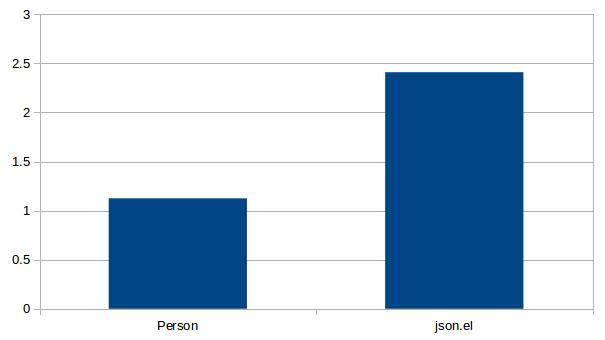

# parson

Binding of parson JSON parser.

## Requirement

This package uses Emacs 25 dynamic module feature.

## API

### `(parson-parse string)`

Parse JSON string `string` and return Emacs Lisp object.

### `(parson-stringify object)`

Encode `object` into JSON.

## Benchmark(parson vs json.el standard library)

- **Y-axis means second.**
- **Lower is better**

Benchmark code is under `bench/`.

#### Encoding scalar 100,000 times

#### Encoding 5 elements list 100,000 times

#### Encoding [complex object](bench/bench.json) 10,000 times

#### Decoding empty list 100,000 times

#### Decoding empty object 100,000 times

## License

- This software is released under the GPLv3.
- parson is released under the MIT License
